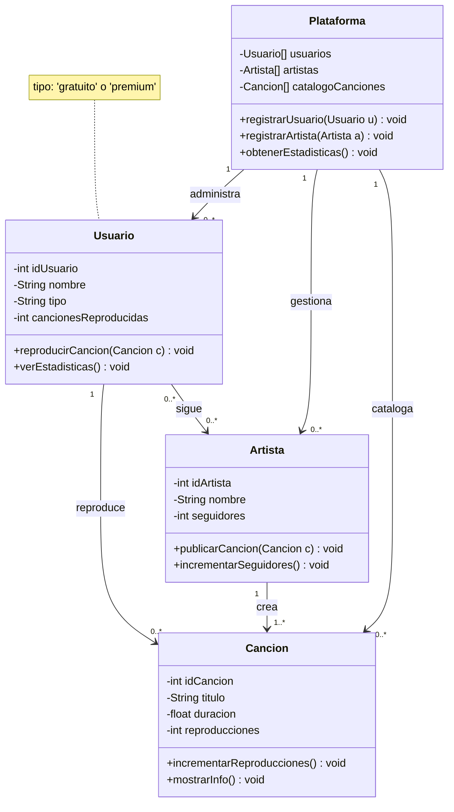

# 📊 Sistema de Música - Spotify Latinoamérica

## Diagrama UML de Clases

## 📋 Descripción de Clases

### 🏢 Plataforma
- **Atributos:** Lista de usuarios, artistas y catálogo de canciones
- **Métodos:** Registrar usuarios/artistas, obtener estadísticas
- **Relaciones:** Administra usuarios, artistas y canciones

### 👤 Usuario  
- **Atributos:** ID, nombre, tipo (gratuito/premium), contador de reproducciones
- **Métodos:** Reproducir canciones, ver estadísticas personales
- **Relaciones:** Reproduce canciones, sigue artistas

### 🎤 Artista
- **Atributos:** ID, nombre, número de seguidores
- **Métodos:** Publicar canciones, incrementar seguidores
- **Relaciones:** Crea canciones, es seguido por usuarios

### 🎵 Canción
- **Atributos:** ID, título, duración, contador de reproducciones
- **Métodos:** Incrementar reproducciones, mostrar información
- **Relaciones:** Creada por artista, reproducida por usuarios

## 🔗 Relaciones del Sistema

| Relación | Tipo | Descripción |
|----------|------|-------------|
| Usuario → Canción | Asociación | Un usuario reproduce múltiples canciones |
| Artista → Canción | Composición | Un artista crea múltiples canciones |
| Plataforma → Usuario | Agregación | La plataforma contiene usuarios |
| Plataforma → Artista | Agregación | La plataforma contiene artistas |
| Usuario → Artista | Asociación | Usuarios siguen a artistas |

## 💾 Cómo usar en GitHub

1. **Crea un archivo** `README.md` en tu repositorio
2. **Copia y pega** este código completo
3. **GitHub renderizará automáticamente** el diagrama

**¡El diagrama se verá perfecto en tu GitHub!** ✅
